# LLVK_Beginning
Learn Vulkan from scratch
## license of assets
* None of the assets can be used commercially
* Except houdini works commercially

## DualPass RenderHair

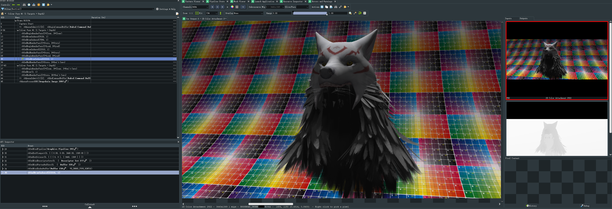
I rewrote a bake system for baking hair occ:
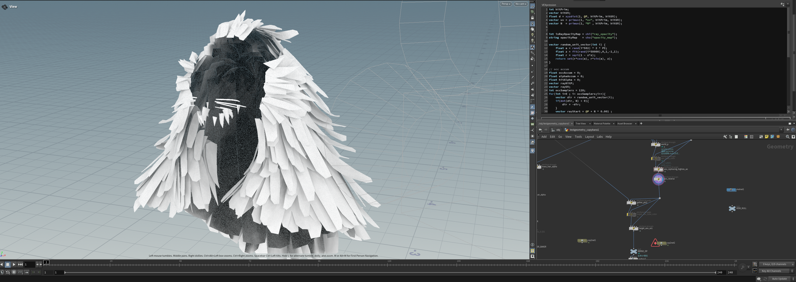
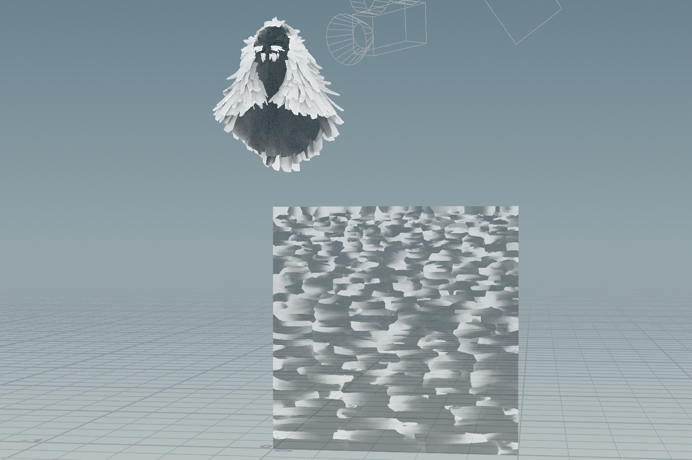


## IndirectDraw 
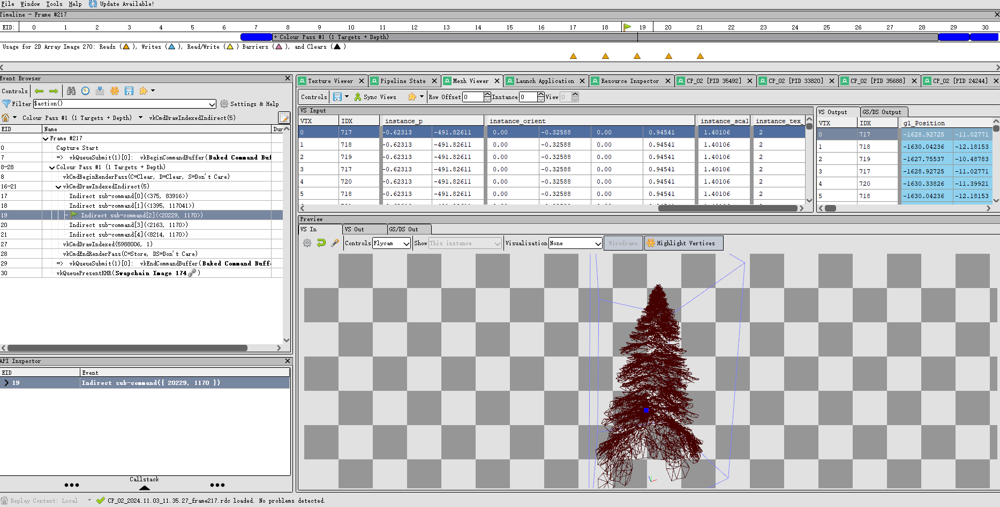


indirect_draw vs instance 😊:
* indirect_draw with all 4K map: 80fps
* instance with all 2k map: 80fps


## Instance 
### updated renderer/instance/instance_v2


### terrain resource gen(houdini20.5):
terrain rendering:

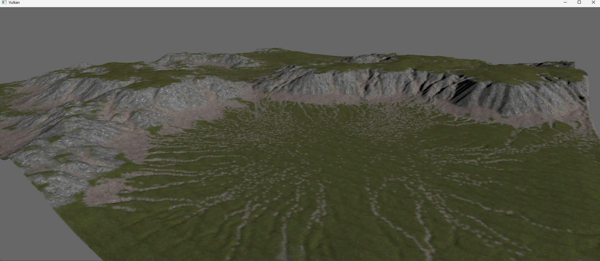

1. generate data from houdini


2. four layers:
* cliff1
* cliff2
* rocks
* grass

3: encoded terrain mask:

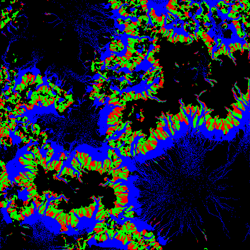

* R:cliff1
* G:cliff2
* B:small_rocks
* A:Grass(as background) fully white color


## shadow map
* opacity/foliage objects rendering
* opaque objects rendering

1:generate depth test:
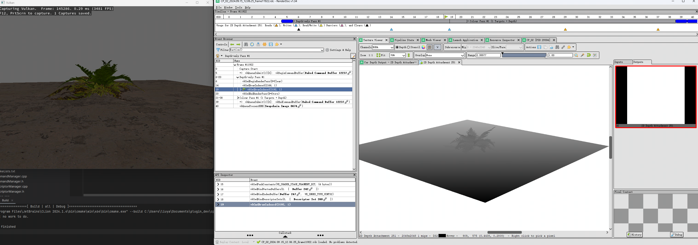
2:using depth and pcf:
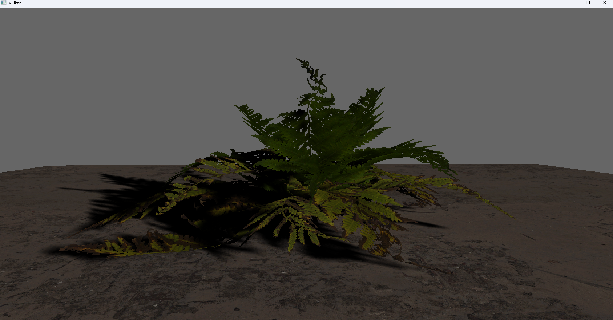

## deferred
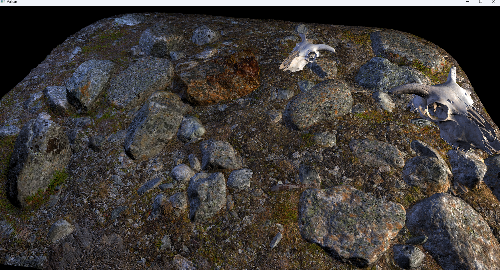
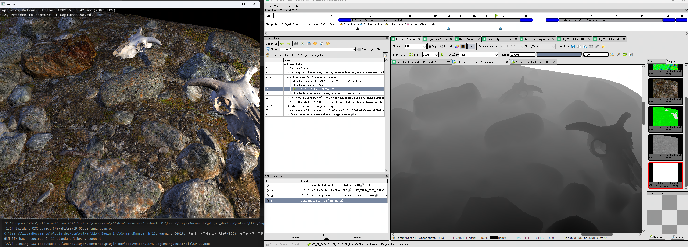

## vma memory management 

## dynamic ubo

## ktx tex array
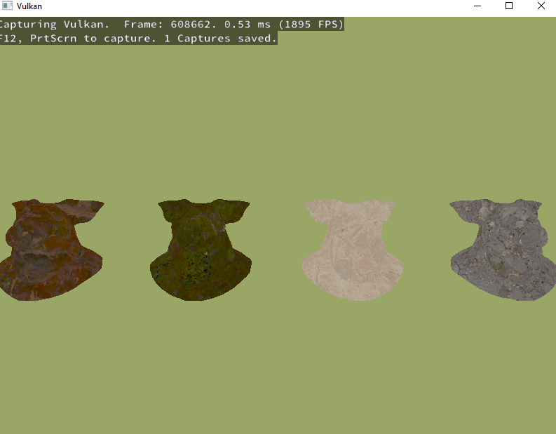


## command tool
### tools\gltf_dump  : gltf info dump
* command interface for dump geometry infos(vertex attributes)
* Clearly determine which object you put first in the gltf primitive, so that you can determine the order of materials
* Note that all gltf objects are discrete triangles,

```
-------------primitive part:0-----------
attrib key:NORMAL value:3
attrib key:POSITION value:1
attrib key:TANGENT value:4
attrib key:TEXCOORD_0 value:2
0 2 1 2 0 3 1 5 4 5 1 2 4 7 6 7 4 5 3 8 2 8 3 9 2 10 5 10 2 8 5 11 7 11 5 10 9 12 8 12 9 13 8 14 10 14 8 12 10 15 11 15 10 14
-------------primitive part:5-----------
attrib key:NORMAL value:8
attrib key:POSITION value:6
attrib key:TANGENT value:9
attrib key:TEXCOORD_0 value:7
0 2 1 2 0 3

```

## REF
```html
https://github.com/SaschaWillems/Vulkan
https://docs.vulkan.org/tutorial/latest/00_Introduction.html
https://docs.vulkan.org/guide/latest/vertex_input_data_processing.html
```
