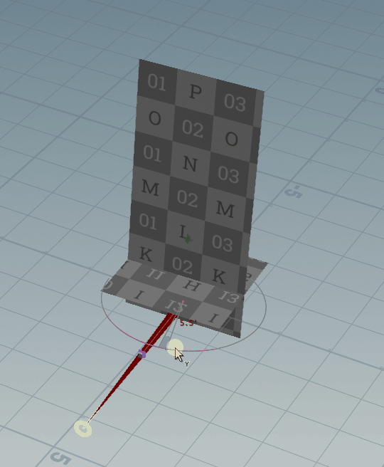
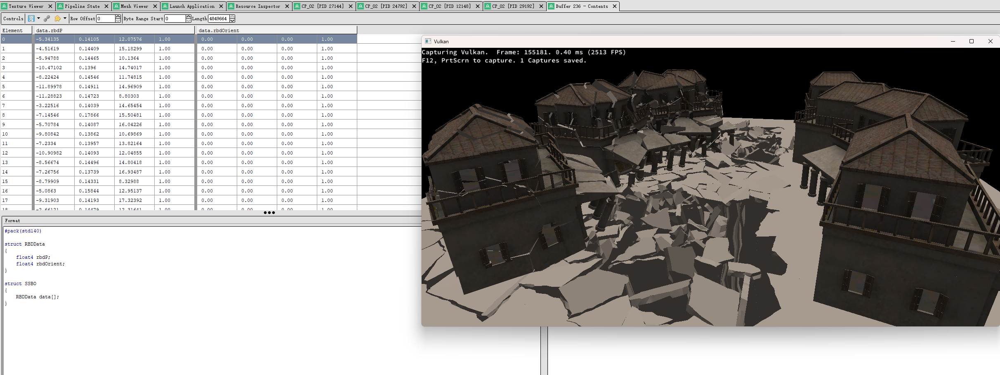

# LLVK_Beginning
Learn Vulkan from scratch
## license of assets
* None of the assets can be used commercially
* Except houdini works commercially

### features
### doing...
* mesh shader
* SSAO
* cpu frustum culling

### todo
* custom resolve ktx2 files
* 3d texture
* lod system
* font rendering
* computeshader image/particle system/fluid simulation
* IMGUI
* click mouse event: pick object based on BVH traveling
* atmosphere
* cloud rendering
* global illumination
* GDC grass system
* GPU path tracing
* CPU and GPU culling
* SSR/GTAO/TAA/FSR/DLSS
* terrain
* multi threading rendering
* runtime virtual textures


### The following features have been implemented :
* subpass
* viewport array
* vma memory management
* spirv-reflection pipelinelayout or metaprogramming for pipelineLayout
* pso object
* dualpass render hair
* cascade shadowmap or shadowmap
* screenshot
* exr file: 32bit image for HDR/Texture
* custom vertex format 
* pbr/GBuffer deferred rendering 
* heightblend based on indexmap
* cubemapping & spheremapping
* 2d image array: ktx2
* indirect draw & instance draw
* rbd vat effects
* command line tools: exr dump/gltf dump/spv dump

## multi viewports


## subpass
### subpass shadowmap

### subpass no shadow:


## billboard 
THE WORLD OF TANKS!

### XZ plane rotation by camera direction
#### 1:use acos(). the range of  acos() : 0->PI


* not fixed:
  

```c++
vector up = chv("up");
vector cam_dir = chv("cam_dir");
cam_dir.y = 0;
up = normalize(up);
cam_dir = normalize(cam_dir);
float cam_dot_front = dot(cam_dir,up );
float angle = degrees( acos (cam_dot_front  ) );
@angle = angle;
```
--------------------

* fixed:

```c++
vector up = chv("up");
vector cam_dir = chv("cam_dir");
cam_dir.y = 0;
up = normalize(up);
cam_dir = normalize(cam_dir);
float cam_dot_front = dot(cam_dir,up );
float cross_product = cross(cam_dir, up).y; 
f@cross_product = cross_product;

float angle = degrees( acos (cam_dot_front  ) );
if(cross_product > 0 ) 
{
    angle *=-1;
}

@angle = angle;
```

rotation billboard use quaternion:
```c++
float angle = radians ( point(1, "angle",0) );
vector4 orient = quaternion(angle, set(0,1,0) );
@P = qrotate(orient, @P);
```

#### 2:use atan2(),the range of atan2():atan2():-PI->PI


```c++
vector up = chv("up");
vector cam_dir = chv("cam_dir");
cam_dir = normalize(cam_dir);
float angle_360 = atan2(cam_dir.x, cam_dir.z);
float angle_view_degrees = degrees(angle_360);
if(angle_view_degrees < 0) angle_view_degrees += 360; 
@angle = angle_view_degrees;
```


## height blend index map


* Consider this method if your terrain surface has more than 16 textures
* It can intuitively support 4 kinds of surface mixing at the same time(Here we just use RG channels
  )

all resource download:
https://drive.google.com/file/d/1qKHuP9KLeSZ3w8a68624mL3u5IMsIJ2D/view?usp=drive_link

encoded R8G8B8A8 indexd image
* R index: first layer (4 layers)
* G index: second layer(2 layers)
* 
* the road snap to terrain with a custom uv R32G32B32A32 SRV(or you can do this with uv2)
* 
```
index a = noise(R) noise(G)
index b = noise(R) noise(G)
index c = noise(R) noise(G)
index d = noise(R) noise(G)

layer01_sA = sample(a.r)
layer01_sB = sample(b.r)
layer01_sC = sample(c.r)
layer01_sD = sample(d.r)

layer02_sA = sample(a.g)
layer02_sB = sample(b.g)
layer02_sC = sample(c.g)
layer02_sD = sample(d.g)

sa = heightblend(layer01_sA,layer02_sA);
sb = heightblend(layer01_sB,layer02_sB);
sc = heightblend(layer01_sC,layer02_sC);
sd = heightblend(layer01_sD,layer02_sD);

vec3 ab = heightblend(sa,sb)
vec3 abc = heightblend(sab,sc)
vec3 abcd = heightblend(sabc,sd)

color01 = (ab+abc+abcd) * 0.33
color02 = (a+b+c+d)*0.25
final = mix(color01, color02, 0.5);
```

* heightblend algorithm: https://zhuanlan.zhihu.com/p/26383778?from_voters_page=true

result:


## screenshot
* swapchainImage(src) ---copy---> image(dst) -> write_uint32

Make sure the following functions of swapchain are enabled:
```c
VkSwapchainCreateInfoKHR createInfoKhr{};
createInfoKhr.imageUsage = VK_IMAGE_USAGE_COLOR_ATTACHMENT_BIT | VK_IMAGE_USAGE_TRANSFER_SRC_BIT;
```


## spheremap 
* spherical mapping
* 32bit HDR exr 
* ACESToneMapping


## cubemap 


## SSBO RBD animation
Implement RBD animation with vulkan SSBO


## RBD VAT

### scene v2
rbd_vat_v2.hip


### scene v1
[rbd_vat.hip](build/bin/content/scene/rbdvat/rbd_vat.hip)


## Dive into Cascade ShadowMap
geometry shader to generate the depth render target


with houdini visualize result: scene/csm/vulkan_csm_visualize.hip


## DualPass RenderHair


I rewrote a bake system for baking hair occ:


## IndirectDraw 


indirect_draw vs instance 😊:
* indirect_draw with all 4K map: 80fps
* instance with all 2k map: 80fps


## Instance 
### updated renderer/instance/instance_v2


### terrain resource gen(houdini20.5):
terrain rendering:


1. generate data from houdini


2. four layers:
* cliff1
* cliff2
* rocks
* grass

3: encoded terrain mask:


* R:cliff1
* G:cliff2
* B:small_rocks
* A:Grass(as background) fully white color


## shadow map
* opacity/foliage objects rendering
* opaque objects rendering

1:generate depth test:

2:using depth and pcf:


## deferred


## vma memory management 

## dynamic ubo

## ktx tex array


## command tool
### tools\gltf_dump  : gltf info dump
* command interface for dump geometry infos(vertex attributes)
* Clearly determine which object you put first in the gltf primitive, so that you can determine the order of materials
* Note that all gltf objects are discrete triangles,

```
-------------primitive part:0-----------
attrib key:NORMAL value:3
attrib key:POSITION value:1
attrib key:TANGENT value:4
attrib key:TEXCOORD_0 value:2
0 2 1 2 0 3 1 5 4 5 1 2 4 7 6 7 4 5 3 8 2 8 3 9 2 10 5 10 2 8 5 11 7 11 5 10 9 12 8 12 9 13 8 14 10 14 8 12 10 15 11 15 10 14
-------------primitive part:5-----------
attrib key:NORMAL value:8
attrib key:POSITION value:6
attrib key:TANGENT value:9
attrib key:TEXCOORD_0 value:7
0 2 1 2 0 3

```
### exr dump
#### dump single part layer:
.\exr_dump.exe position.exr
```text
Not multi part exr: `chunkCount' attribute is not found in the header., roll back to single part exr reader: EXR version: 2
Number of channels: 4
Channel[0]: name = A, pixel_type = HALF, sampling = (1, 1)
Channel[1]: name = B, pixel_type = HALF, sampling = (1, 1)
Channel[2]: name = G, pixel_type = HALF, sampling = (1, 1)
Channel[3]: name = R, pixel_type = HALF, sampling = (1, 1)
first pixel value:1.75879 0.648926 12.7578 1
last pixel value:2.16992 1.61328 26.7812 1
```
#### dump multi part layer:
.\exr_dump.exe multi_ch.exr
```text
exr num parts: 5
C chunk_count:1024  num_channels:4
         Channel[0]: name = A, pixel_type = FLOAT, sampling = (1, 1)
         Channel[1]: name = B, pixel_type = FLOAT, sampling = (1, 1)
         Channel[2]: name = G, pixel_type = FLOAT, sampling = (1, 1)
         Channel[3]: name = R, pixel_type = FLOAT, sampling = (1, 1)
noise chunk_count:1024  num_channels:1
         Channel[0]: name = noise.Z, pixel_type = FLOAT, sampling = (1, 1)
displace chunk_count:1024  num_channels:1
         Channel[0]: name = displace.Z, pixel_type = FLOAT, sampling = (1, 1)
id chunk_count:1024  num_channels:1
         Channel[0]: name = id.Z, pixel_type = UINT, sampling = (1, 1)
vector chunk_count:1024  num_channels:3
         Channel[0]: name = vector.b, pixel_type = FLOAT, sampling = (1, 1)
         Channel[1]: name = vector.g, pixel_type = FLOAT, sampling = (1, 1)
         Channel[2]: name = vector.r, pixel_type = FLOAT, sampling = (1, 1)
Loaded 5 part images, now dump image info use ExrImage
        image name:C image num tiles:0 width: 1024 height:1024 num chans:4
                first pixel value:-0.0527842 0.0313708 -0.0606085 1
                last pixel value:-0.188693 0.0616372 -0.0752638 1
        image name:noise image num tiles:0 width: 1024 height:1024 num chans:1
        image name:displace image num tiles:0 width: 1024 height:1024 num chans:1
        image name:id image num tiles:0 width: 1024 height:1024 num chans:1
        image name:vector image num tiles:0 width: 1024 height:1024 num chans:3
```


## REF
```html
https://github.com/SaschaWillems/Vulkan
https://docs.vulkan.org/tutorial/latest/00_Introduction.html
https://docs.vulkan.org/guide/latest/vertex_input_data_processing.html
```
