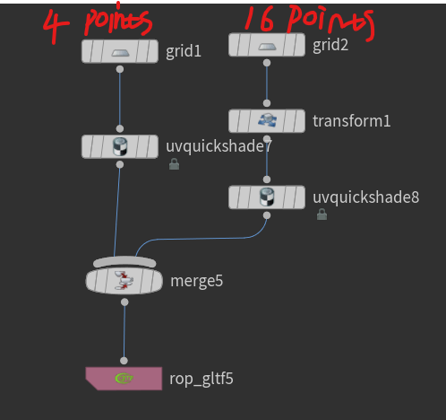
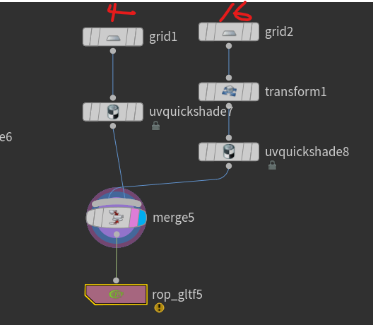

## shader order

in houdini, when all shaded objects plug into merge node,
the merge node inputs is the gltf primitive order

The meaning is the same as fbx face material id

### order: 4 points before merge


gltf_dump.exe:

```bash
-------------primitive part:0-----------
key:NORMAL value:3
key:POSITION value:1
key:TANGENT value:4
key:TEXCOORD_0 value:2
0 2 1 2 0 3
-------------primitive part:5-----------
key:NORMAL value:8
key:POSITION value:6
key:TANGENT value:9
key:TEXCOORD_0 value:7
0 2 1 2 0 3 1 5 4 5 1 2 4 7 6 7 4 5 3 8 2 8 3 9 2 10 5 10 2 8 5 11 7 11 5 10 9 12 8 12 9 13 8 14 10 14 8 12 10 15 11 15 10 14

```

### order: 16 points before merge


```bash
-------------primitive part:0-----------
attrib key:NORMAL value:3
attrib key:POSITION value:1
attrib key:TANGENT value:4
attrib key:TEXCOORD_0 value:2
0 2 1 2 0 3 1 5 4 5 1 2 4 7 6 7 4 5 3 8 2 8 3 9 2 10 5 10 2 8 5 11 7 11 5 10 9 12 8 12 9 13 8 14 10 14 8 12 10 15 11 15 10 14
-------------primitive part:5-----------
attrib key:NORMAL value:8
attrib key:POSITION value:6
attrib key:TANGENT value:9
attrib key:TEXCOORD_0 value:7
0 2 1 2 0 3

```